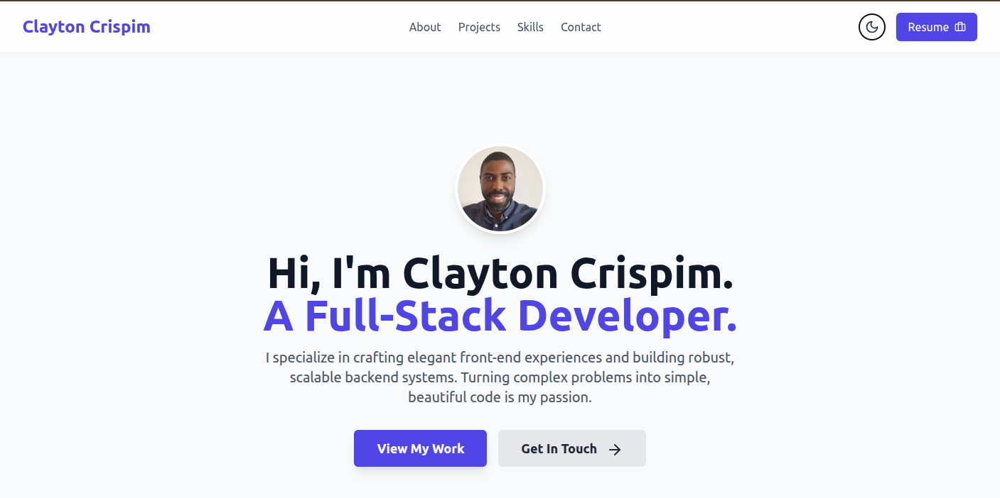

# Clayton Crispim - Full-Stack Developer Portfolio

This repository contains the source code for my personal portfolio website, built from the ground up to showcase my skills in modern front-end and back-end development. The live version can be viewed at [claytoncrispim.com](https://www.claytoncrispim.com).



## Technology Stack

This project was built using a modern, type-safe, and efficient technology stack to ensure a great developer experience and a fast, responsive user experience.

## Key Features

* Dynamic Project Showcase: Project data is managed in a clean, structured array, making it easy to update and maintain.

* Dark Mode: A sleek, user-friendly dark mode toggle that respects user preferences and persists across sessions.

* Responsive Design: Fully mobile-first design that ensures a seamless experience on all devices, from phones to desktops.

* Serverless Contact Form: A fully functional contact form that integrates with a serverless function for email submission.

* Data-Driven Styling: Components are designed to be flexible, allowing for custom styles (like image positioning) to be driven directly by the data.

## Running Locally

To get a local copy up and running, follow these steps.

1. Clone the repository:
    ```sh
    git clone https://github.com/claytoncrispim/fullstack-portfolio.git
    ```
    ```sh
    cd fullstack-portfolio
    ```

2. Install dependencies:

    ```sh 
    npm install
    ```


3. Start the development server:
    ```sh
    npm run dev
    ```

    The application will be available at http://localhost:5173.

## Deployment

This site is automatically built and deployed via [Netlify](https://www.netlify.com/). Every push to the ```main``` branch triggers a new deployment.